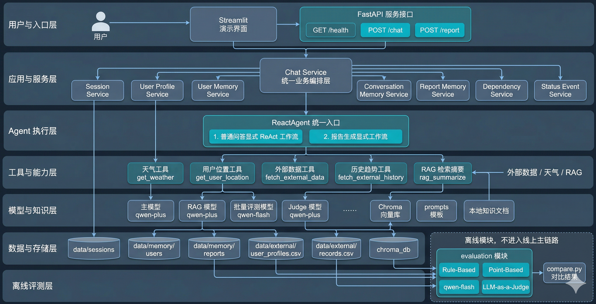

# 智扫通 Agent 项目

一个面向扫地机器人客服问答与使用报告生成场景的 Agent 项目。项目提供 `Streamlit` 演示界面、`FastAPI` 服务接口、RAG 检索、用户记忆、离线评测和 Docker 部署入口。

## 核心能力

- 普通问答、故障排查、环境适配建议
- 月度使用报告与趋势分析
- 轻量 LLM 语义归一化与显式 ReAct 工作流
- 天气工具调用与本地知识库检索
- 多轮会话、用户长期记忆、报告记忆
- `Streamlit` 演示入口与 `FastAPI` 标准接口
- 离线评测、结果对比与可选 Judge 评分

## 系统结构

项目当前包含两条核心业务链路：

- 普通问答链路  
  使用显式 LangGraph ReAct 工作流，先通过轻量 LLM 语义归一化节点提取稳定意图、城市、环境前提与缺失槽位，再围绕“分析问题 -> 调工具 -> 观察结果 -> 生成回答”组织执行。

- 报告生成链路  
  使用独立的显式报告工作流，强调用户身份、月份、外部记录、趋势信息、知识补充和时间一致性。

两条链路共享同一套服务层、会话存储、用户记忆和评测体系。



## 技术栈

- Python 3.13
- Streamlit
- FastAPI
- LangChain / LangGraph
- Chroma
- DashScope
- Requests
- Docker

## 目录结构

```text
.
├─config/                         # 配置文件
├─data/                           # 知识库、用户资料、外部记录、会话、评测数据
├─docs/                           # 使用文档与截图
├─prompts/                        # 提示词模板
├─src/
│  └─smart_clean_agent/
│     ├─agent/                    # Agent、tools、middleware、显式工作流
│     ├─api/                      # FastAPI 入口与 schema
│     ├─evaluation/               # 离线评测
│     ├─model/                    # 模型工厂
│     ├─rag/                      # RAG 与向量库
│     ├─services/                 # 会话、记忆、依赖校验、聊天服务
│     ├─ui/                       # Streamlit UI 组件
│     ├─utils/                    # 通用工具
│     └─web/                      # Streamlit 入口与 bootstrap
├─tests/                          # 测试
├─Dockerfile
├─pyproject.toml
├─README.md
└─requirements.txt
```

## 模型配置

默认模型角色配置在 [rag.yml](e:/Python/Agent项目/config/rag.yml)：

- 在线主链路：`qwen-plus`
- 语义归一化：`qwen-flash`
- RAG 总结：`qwen-plus`
- 离线批量评测：`qwen-flash`
- Judge：`qwen-plus`
- Embedding：`text-embedding-v4`

当前实现支持按角色切换模型名，不包含 `enable_thinking`、温度、`top_p` 等额外推理参数配置。

## 本地运行

### 1. 安装依赖

```powershell
python -m venv .venv
.\.venv\Scripts\Activate.ps1
pip install -r requirements.txt
```

### 2. 配置环境变量

在根目录创建 `.env`，或直接配置系统环境变量，至少需要：

- `DASHSCOPE_API_KEY`
- `AMAP_WEATHER_API_KEY`（可选）

示例：

```env
DASHSCOPE_API_KEY=your_dashscope_api_key
AMAP_WEATHER_API_KEY=your_amap_weather_api_key
```

### 3. 构建向量库

```powershell
python src/smart_clean_agent/rag/ingest.py
```

### 4. 启动 Streamlit

```powershell
streamlit run src/smart_clean_agent/web/app.py
```

### 5. 启动 FastAPI

```powershell
uvicorn smart_clean_agent.api.main:app --app-dir src --reload
```

## API 入口

当前提供 3 个接口：

- `GET /health`
- `POST /chat`
- `POST /report`

启动后可访问：

- Swagger 文档：`http://127.0.0.1:8000/docs`
- 健康检查：`http://127.0.0.1:8000/health`

详细接口说明见 [API 使用说明](e:/Python/Agent项目/docs/api_usage_guide.md)。

### 聊天接口示例

```powershell
Invoke-RestMethod -Method POST `
  -Uri "http://127.0.0.1:8000/chat" `
  -ContentType "application/json" `
  -Body '{"user_id":"1001","message":"北京今天天气怎么样？"}'
```

### 报告接口示例

```powershell
Invoke-RestMethod -Method POST `
  -Uri "http://127.0.0.1:8000/report" `
  -ContentType "application/json" `
  -Body '{"user_id":"1001","query":"生成我的本月使用报告"}'
```

## 离线评测

项目提供一套独立的离线评测模块，用于复用真实 Agent 链路，对样例集进行结构化评估。

### 默认运行

```powershell
python src/smart_clean_agent/evaluation/run.py
```

### 启用 Judge

```powershell
python src/smart_clean_agent/evaluation/run.py --with-judge
```

### 覆盖评测模型

```powershell
python src/smart_clean_agent/evaluation/run.py --chat-model qwen-plus
```

### 指定 Judge 模型

```powershell
python src/smart_clean_agent/evaluation/run.py --with-judge --judge-model qwen-turbo
```

评测结果默认输出到 `data/eval/results/`，详细说明见 [Eval 使用说明](e:/Python/Agent项目/docs/eval_usage_guide.md)。

## Docker 部署

### 1. 构建镜像

```powershell
docker build -t agent-service .
```

### 2. 启动容器

```powershell
docker run -p 8000:8000 --env-file .env agent-service
```

说明：

- 仓库默认不上传 `chroma_db`
- 启动 Docker 前请先在本地完成 `python src/smart_clean_agent/rag/ingest.py`
- 如果镜像里也需要可用向量库，请在部署方案中额外挂载或打包向量库产物

## 评测维度

离线评测默认包含三层能力：

- Rule-Based  
  评估路由、工具依赖、检索模式、时间一致性等结构化行为。

- Point-Based  
  评估答案是否覆盖样例中定义的核心要点。

- LLM-as-a-Judge  
  以独立模型对正确性、完整性、groundedness、工具使用与报告质量进行语义评分。

普通问答链路强调语义归一化后的意图稳定性、结果正确性与工具使用合理性；报告链路更关注数据依赖、时间一致性和内容可信度。

## 当前能力范围

- 用户资料管理与会话切换
- 普通客服问答
- 模糊表达、口语化输入与轻微错别字的语义归一化
- 天气工具调用
- RAG 检索问答
- 月度报告生成
- 长期用户记忆
- 多月趋势记忆
- Streamlit 演示界面
- FastAPI 服务接口
- Docker 部署入口
- 离线评测与结果对比

## 注意事项

- 当前项目默认使用文件型存储，不是数据库方案
- 当前 Docker 方案是单容器部署，不包含多服务编排
- 仓库默认不提交 `.env`、`chroma_db`、日志、评测结果和本地 memory 运行产物

## 相关文档

- [API 使用说明](e:/Python/Agent项目/docs/api_usage_guide.md)
- [Eval 使用说明](e:/Python/Agent项目/docs/eval_usage_guide.md)
