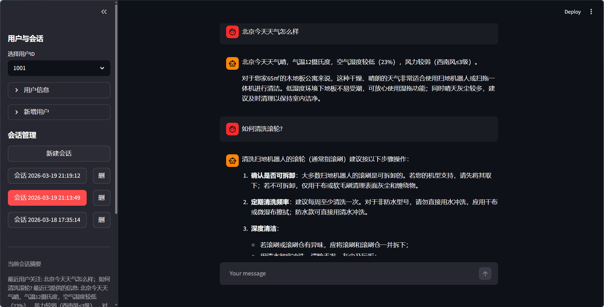
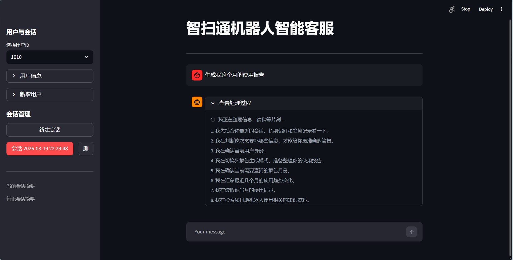
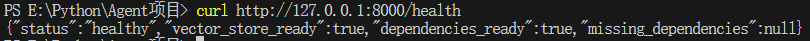

# 智扫通 Agent 项目

一个围绕“扫地机器人智能客服 + 使用报告生成”场景构建的 Agent 项目。当前版本同时提供 `Streamlit` 演示界面、`FastAPI` 标准服务接口、`RAG + Memory` 能力、离线建库、离线评测和 Docker 部署入口。

## 项目亮点

- 支持普通问答、天气查询、知识检索、报告生成、多轮上下文记忆
- 将 `Streamlit` 演示层和 `FastAPI` 服务层解耦，共用统一业务服务层
- 支持按用户分组的会话持久化、用户长期记忆和多月趋势报告记忆
- 普通问答已重构为显式 LangGraph ReAct 工作流，报告生成保留独立高约束链路
- 提供离线评测能力，支持 `rule-based + point-based + judge` 三层输出
- 采用 `src` 布局，代码集中在 `src/smart_clean_agent/`

## 效果截图





## 技术栈

- Python 3.13
- Streamlit
- FastAPI
- LangChain / LangGraph
- Chroma
- DashScope
- Requests
- Docker

## 当前 Agent 设计

### 普通问答链路

当前普通问答不再只依赖 `prompt + create_agent` 的隐式工具调用，而是显式走一条 LangGraph ReAct 风格工作流：

- `analyze_question`
- `select_tool_or_finish`
- `execute_tool`
- `observe_tool_result`
- `generate_answer`

普通问答默认只允许使用这些工具：

- `get_user_location`
- `get_weather`
- `rag_summarize`

这样可以同时保留 Agent 的自主决策能力和工程上的可审计性。中间 trace 只进入日志、评测和内部状态，不直接暴露给用户。

### 报告生成链路

报告生成仍然保留独立链路，并在启动阶段显式补齐关键上下文准备：

- `get_user_id`
- `get_current_month`
- `fill_context_for_report`

随后再进入报告生成、外部数据读取和趋势分析。报告任务比普通问答更强调数据依赖、时间一致性和 groundedness。

## 目录结构

```text
.
├─config/                         # 配置文件
├─data/                           # 知识库、用户资料、外部记录、会话、记忆
├─docs/                           # 使用文档与截图
├─prompts/                        # 提示词模板
├─src/
│  └─smart_clean_agent/
│     ├─agent/                    # Agent、tools、middleware
│     ├─api/                      # FastAPI 入口与 schema
│     ├─evaluation/               # 离线评测
│     ├─model/                    # 模型工厂
│     ├─rag/                      # RAG 与向量库
│     ├─services/                 # 会话、记忆、依赖校验、聊天服务
│     ├─ui/                       # Streamlit UI 组件
│     ├─utils/                    # 通用工具
│     └─web/                      # Streamlit 入口与 bootstrap
├─tests/                          # 测试
├─Dockerfile
├─pyproject.toml
├─README.md
└─requirements.txt
```

## 本地运行

当前默认模型角色配置在 `config/rag.yml`：

- 在线主链路：`qwen-plus`
- RAG 总结：`qwen-plus`
- 离线批量评测：`qwen-flash`
- Judge：`qwen-plus`
- Embedding：`text-embedding-v4`

### 1. 安装依赖

```powershell
python -m venv .venv
.\.venv\Scripts\Activate.ps1
pip install -r requirements.txt
```

### 2. 配置环境变量

在根目录创建 .env 或直接配置环境变量Path，需要：

- `DASHSCOPE_API_KEY` 千问模型
- `AMAP_WEATHER_API_KEY` 高德天气服务（可选）

.env 示例：

```env
DASHSCOPE_API_KEY=your_dashscope_api_key
AMAP_WEATHER_API_KEY=your_amap_weather_api_key
```

### 3. 先建库

```powershell
python src/smart_clean_agent/rag/ingest.py
```

### 4. 启动 Streamlit

```powershell
streamlit run src/smart_clean_agent/web/app.py
```

### 5. 启动 FastAPI

```powershell
uvicorn smart_clean_agent.api.main:app --app-dir src --reload
```

## API 说明

当前提供 3 个接口：

- `GET /health`
- `POST /chat`
- `POST /report`

启动后可访问：

- Swagger 文档：`http://127.0.0.1:8000/docs`
- 健康检查：`http://127.0.0.1:8000/health`

详细接口说明见 [API 使用说明](docs/api_usage_guide.md)。

### 聊天接口示例

```powershell
Invoke-RestMethod -Method POST `
  -Uri "http://127.0.0.1:8000/chat" `
  -ContentType "application/json" `
  -Body '{"user_id":"1001","message":"北京今天天气怎么样？"}'
```

### 报告接口示例

```powershell
Invoke-RestMethod -Method POST `
  -Uri "http://127.0.0.1:8000/report" `
  -ContentType "application/json" `
  -Body '{"user_id":"1001","query":"生成我的本月使用报告"}'
```

## Docker 部署

### 1. 构建镜像

```powershell
docker build -t agent-service .
```

### 2. 启动容器

```powershell
docker run -p 8000:8000 --env-file .env agent-service
```

说明：

- 当前仓库默认不上传 `chroma_db`
- Docker 启动前请先在本地完成 `python src/smart_clean_agent/rag/ingest.py`
- 如果镜像里也需要可用向量库，请在部署方案里额外处理挂载或构建产物

## 离线评测

运行：

```powershell
python src/smart_clean_agent/evaluation/run.py
```

启用 Judge：

```powershell
python src/smart_clean_agent/evaluation/run.py --with-judge
```

评测执行模型默认使用 `qwen-flash`。如果你想临时切回更强模型：

```powershell
python src/smart_clean_agent/evaluation/run.py --chat-model qwen-plus
```

指定 Judge 模型：

```powershell
python src/smart_clean_agent/evaluation/run.py --with-judge --judge-model qwen-turbo
```

当前评测默认使用 `data/eval/eval_cases.jsonl`，并输出三层结构：

- `rule_based_summary`
- `judge_based_summary`
- `normal_summary`
- `report_summary`
- `results`

其中规则层重点关注：

- 路由是否正确
- 必需工具是否完整
- 普通问答工具是否合理
- 报告链路关键依赖是否成立
- required points 是否覆盖
- 报告时间一致性是否成立

当前评测哲学已经按任务类型区分：

- 普通问答：结果正确性和工具合理性优先，不把严格工具顺序当作硬门槛
- 报告生成：关键数据依赖和时间一致性优先，不再要求死板全序，但要求关键依赖成立

Judge 层默认关闭，只用于离线语义评分，不进入线上主链路。
当前实现只做模型切换，不开放 `enable_thinking` 等 DashScope 推理参数。

评测结果默认输出到 `data/eval/results/`。

对比两个评测结果：

```powershell
python src/smart_clean_agent/evaluation/compare.py `
  data/eval/results/old.json `
  data/eval/results/new.json
```

## 当前能力

- 用户资料管理与会话切换
- 普通客服问答（显式 ReAct）
- 天气工具调用
- RAG 检索问答
- 使用报告生成（独立高约束链路）
- 多月趋势记忆
- 长期用户记忆
- 灰色过程说明流 + 最终回答流式展示
- FastAPI 标准接口
- Docker 部署入口
- `rule-based + point-based + judge` 离线评测

## 注意事项

- 当前项目默认使用文件型存储，不是数据库方案
- 当前 Docker 方案是单容器部署，不包含多服务编排
- 仓库默认不提交 `.env`、`chroma_db`、日志和评测结果

## 相关文档

- [API 使用说明](docs/api_usage_guide.md)
- [Eval 使用说明](docs/eval_usage_guide.md)
